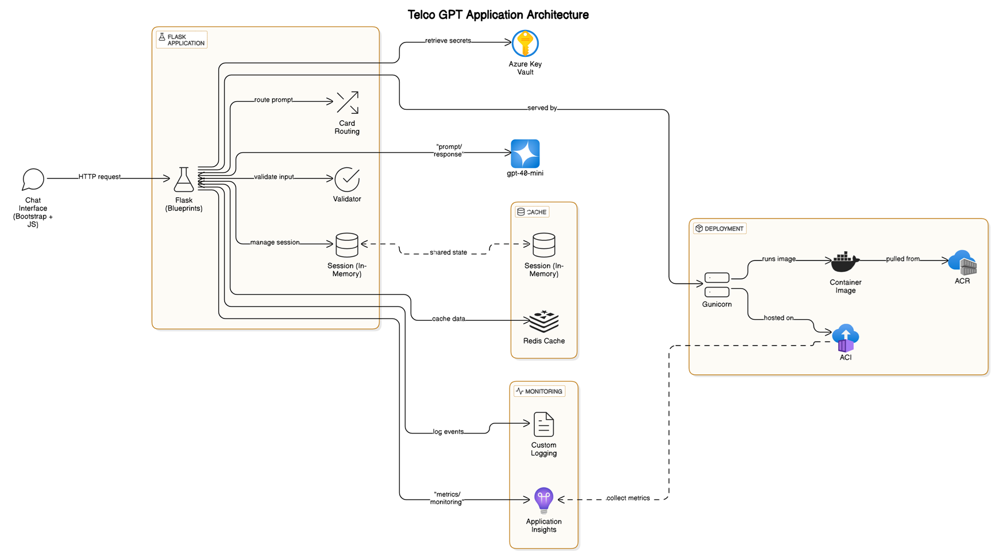
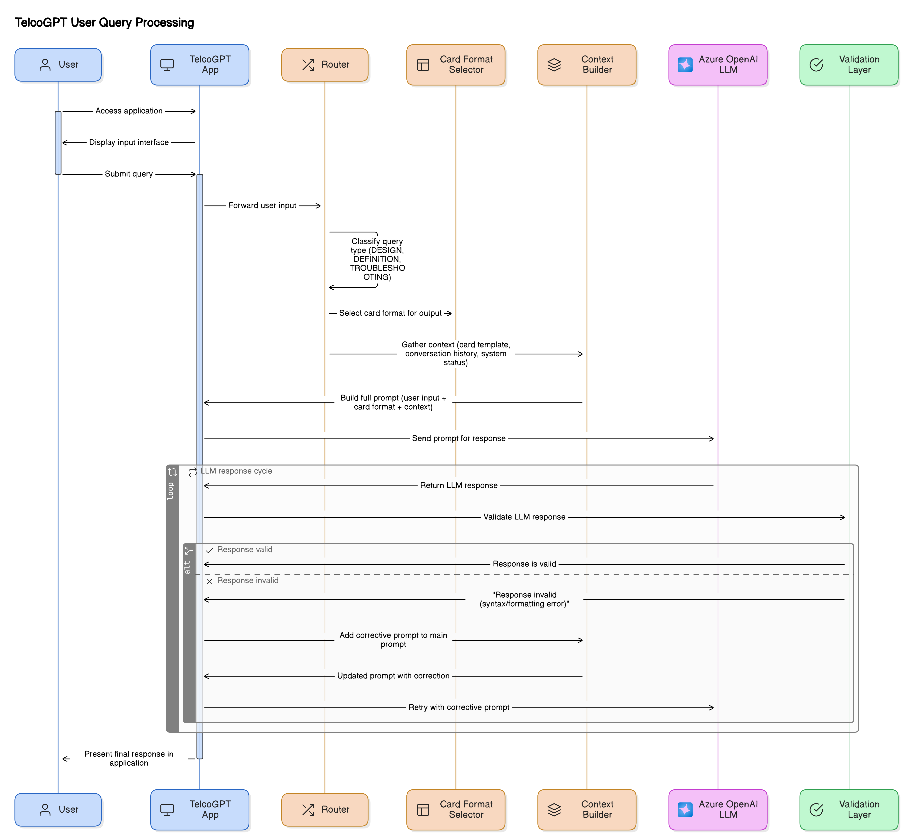

---

# 📡 TelcoGPT – Prompt‑Only Telecom Q\&A Assistant

> **Version 1.0** · MAY 2025
> **Developed by Blue Data Consulting**

---

## 📘 Introduction

**TelcoGPT** is an internal GenAI tool purpose-built for **Telecom Engineers**, including Site Engineers and RF Engineers. When these professionals need to brainstorm, troubleshoot issues, or answer domain-specific questions, general-purpose LLMs often fail to grasp the telecom context. The result? Frustration, inaccuracy, and inefficiency.

### 🧠 Problem Statement

Site and RF Engineers regularly seek quick, accurate answers to telecom-related questions during their daily work. However, general LLMs lack telecom context, forcing users to over-explain or manually craft detailed queries. This leads to:

* Reduced productivity
* Repetitive manual prompting
* Low trust in AI assistance

### 🎯 The Solution

TelcoGPT simplifies this with a **prompt-engineered assistant** preloaded with telecom-aware context. Users can:

* Ask direct questions like "What is 3GPP?" or "What is RAM in telecom?"
* Skip long contextual instructions
* Get formatted responses in three smart templates:

  * **Definition**
  * **Troubleshooting**
  * **Design Recommendation**




---

## 🏗️ Architecture Overview

* **LLM Backend:** Azure OpenAI GPT‑4o Mini
* **Framework:** Python Flask (3.x)
* **Frontend:** Bootstrap Chat UI
* **Containerization:** Azure Container Instances (ACI) + Azure Container Registry (ACR)

---

## ⚙️ Prerequisites

| Component          | Description                                            |
| ------------------ | ------------------------------------------------------ |
| Azure Subscription | Must have Contributor rights                           |
| Local Tools        | `az CLI`, `git`, `python 3.11+`, `pip`, `jq`, `docker` |
| OS                 | Linux/macOS/Windows (WSL‑2 recommended for Windows)    |

---

## 📦 Azure Resource Variables (Set Once)

```bash
# Resource configuration
RG="Tredence-B3"                  # Resource Group
LOCATION="eastus2"              # Azure Region
ACR="telcogptacr"                    # Azure Container Registry Name
IMG="telcogpt:v1"                    # Image Name
ACI="telcogpt-aci"                   # Azure Container Instance
PORT=8080                            # App Port

AZURE_OPENAI_ENDPOINT="https://swedencentral.api.cognitive.microsoft.com/"
AZURE_OPENAI_API_KEY="xxxxxxxxxxxxxxxxxxxxxxx"
OPENAI_API_VERSION="2024-12-01-preview"
```

---

## ☁️ Step 1 – Provision Azure OpenAI Resource

```bash
az login

az cognitiveservices account create \
    --name $ACR \
    --resource-group $RG \
    --location $LOCATION \
    --kind OpenAI \
    --sku s0

az cognitiveservices account show \
    --name $ACR \
    --resource-group $RG | jq -r .properties.endpoint

az cognitiveservices account keys list \
    --name $ACR \
    --resource-group $RG | jq -r .key1
```

Create a `.env` file and store the credentials:

```bash
AZURE_OPENAI_ENDPOINT="$AOAI_ENDPOINT"
AZURE_OPENAI_API_KEY="$AOAI_KEY"
```

---

## 🧪 Step 2 – Setup Local Development

```bash
cd ~/Desktop/TelcoGPT
python -m venv gen-ai && source gen-ai/bin/activate
mkdir -p app/static app/templates prompts
pip install flask redis openai pytest

# Create placeholders
 touch app/__init__.py app/routes.py app/cards.py \
       app/prompt_builder.py app/validator.py
 touch prompts/system_prompt.txt
```

Run the app:

```bash
flask --app app run
```

Visit: [http://127.0.0.1:5000/](http://127.0.0.1:5000/)

Test API:

```bash
curl -s http://127.0.0.1:5000/chat \
  -H "Content-Type: application/json" \
  -d '{"message":"error code P0610 on eNB 410"}' | jq .
```

---

## 🐳 Step 3 – Containerize and Test Locally

```bash
# Build the Docker image
sudo docker build -t $IMG .
# to check current docker images
sudo docker images -a

# to check current docker containers
sudo docker ps -a 

# Run locally
sudo docker run -d -p 8080:8080 \
  -e AZURE_OPENAI_ENDPOINT=$AZURE_OPENAI_ENDPOINT \
  -e AZURE_OPENAI_API_KEY=$AZURE_OPENAI_API_KEY \
  -e OPENAI_API_VERSION=$OPENAI_API_VERSION \
  $IMG

# to check docker contianers
sudo docker ps -a


```

---

## 🚀 Step 4 – Push to Azure Container Registry (ACR)

```bash
az acr create -g $RG -n $ACR --sku Basic --admin-enabled true
az acr login -n $ACR
sudo docker tag $IMG $ACR.azurecr.io/$IMG
sudo docker push $ACR.azurecr.io/$IMG
```

---

## 🌐 Step 5 – Deploy to Azure Container Instance (ACI)

```bash
az container create -g $RG -n $ACI \
  --image $ACR.azurecr.io/$IMG \
  --registry-login-server $ACR.azurecr.io \
  --registry-username $(az acr credential show -n $ACR --query username -o tsv) \
  --registry-password $(az acr credential show -n $ACR --query passwords[0].value -o tsv) \
  --cpu 1 --memory 1 --ports $PORT --os-type Linux --ip-address public \
  --dns-name-label telcogpt-demo \
  --environment-variables \
    AZURE_OPENAI_ENDPOINT=$AOAI_ENDPOINT \
    AZURE_OPENAI_API_KEY=$AOAI_KEY
```

---

## 🔍 Step 6 – Check Deployment

```bash
az container show -g $RG -n $ACI \
  --query "ipAddress.{fqdn:fqdn,ip:ip,ports:ports}" -o table
```

Browse your deployed app at:
**[http://telcogpt-demo-9475.\$LOCATION.azurecontainer.io:8080/](http://telcogpt-demo-9475.$LOCATION.azurecontainer.io:8080/)**

---

## 🧹 Step 7 – Cleanup

```bash
az container delete -g $RG -n $ACI --yes
az acr delete -g $RG -n $ACR --yes
```

---

## 📄 License & Ownership

© 2025 Blue Data Consulting – All rights reserved.
